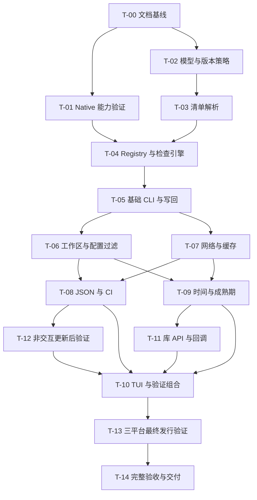

# 实施任务与完成标准

版本：0.3。T-00 文档基线、T-01～T-05 的 P1a 子集和 T-05 的 P1b 写回实现已交付。P1b 常规测试已通过；AC-044 的文件符号链接实机场景受当前 Windows 权限限制，保持待验证，不能将整个 AC-044 标为通过。后续任务仍待实施。任务编号是稳定标识，不代表工期估算。核验详情见 [P1a 证据](evidence-p1a.md)、[P1b 证据](evidence-p1b.md)。

## 1. 需求分析与推进路径

### 1.1 优先级判断

需求的主要价值是“准确找出已有依赖的可更新版本，并可靠地改回项目”。完整移植范围保持不变，按正确性、可用性、规模和体验安排交付：

| 优先级 | 需求重点 | 推进决定 |
| --- | --- | --- |
| 正确性基础 | REQ-001/004/005/006/010/020，NFR-001/002 | 版本语义、真实声明识别、错误阻止写入、文件完整性是先决条件；不能用后续优化替代 |
| 首个可用结果 | REQ-002/009 的单模块部分 | 先交付只读检查，让真实项目验证版本结论，再开放写入 |
| 仓库与自动化 | REQ-003/007/008/012/013/014/015/019 | 工作区和配置决定检查对象，JSON/CI/verify 提供自动化价值；优先于 TUI |
| 完整策略 | REQ-016/017、REQ-006 的时间模式 | 依赖详情请求、时钟及错误处理；复用成熟的查询层后实现 |
| 复用与体验 | REQ-018/011 | 先形成稳定 check/apply 行为和类型，再完成公共 API 与交互，避免界面拥有另一套策略 |
| 全程约束 | NFR-003/004 | 从第一步就用隔离测试和平台适配；最终三平台验收不能只在开发末期才开始发现问题 |

### 1.2 七个验收里程碑

| 里程碑 | 对应任务 | 可交付结果 | 放行门槛 |
| --- | --- | --- | --- |
| P0：验证实现基础 | T-01；T-02 可独立启动 | 选定 Native 工具链/IO 依赖及能力报告；明确核心类型归属 | Windows HTTPS/证书、文件读取/替换、进程能力有实际结果；接口存在不算验证通过 |
| P1a：只读检查闭环 | T-02～04、T-05 只读部分 | `moon-taze -C <单模块>` 展示准确推荐，六种非时间模式可用 | 固定版本梯和异常元数据测试通过；真实 API 只读冒烟通过；无项目写入、有限超时、不挂起 |
| P1b：可靠写回闭环 | T-05 写入部分 | `moon-taze patch -w` 仅修改目标版本，重复执行无变化 | 字节保真、过期计划、锁冲突、准备失败及部分提交测试通过；任何解析/查询错误均阻止应用 |
| P2：仓库与 CI 可用 | T-06～08、T-12 非交互部分 | 工作区/递归、过滤配置、网络韧性、JSON/CI、`-w --verify` | 本地依赖不查远端，查询去重/缓存正确，退出码可依赖；验证失败保留准确应用报告 |
| P3a：完整策略与库 API | T-09、T-11 | 八模式齐备、成熟期/时间信息、正式 check/resolve/apply 和回调 | 未知发布时间处理明确，离线结果确定；API 不暴露内部实现类型，不绕过统一选择/写入规则 |
| P3b：完整交互体验 | T-10；T-12 交互组合回归 | 选择依赖/版本、确认、滚动、取消和终端恢复 | 与非交互模式共用计划和应用引擎；非 TTY/JSON 优先级、取消及 verify 联动通过 |
| P4：三平台发行 | T-13 最终验收、T-14 | 有明确架构、运行库和工具链要求的 Native 产物与使用说明 | 全部适用验收闭合，每个平台有运行证据；未实测架构不标为支持 |

P1a/P1b 合为原 P1，P3a/P3b 合为原 P3；新增 P0 将技术可行性单列。首个可演示成果是 P1a，首个可实际维护独立模块的成果是 P1b，仓库/CI 使用的首个里程碑是 P2。早期产物是实验版本，只承诺已通过的功能子集，完整移植在 P4 验收结束。

### 1.3 对原任务顺序的调整

- T-01 不阻止 T-02 的纯类型、SemVer 和离线测试；只有接入 Native IO 的 T-04 需要 T-01 通过。T-03 依赖 T-02 的基础类型/版本解析，不必等待全部模式写完。
- T-05 拆成只读验收与写回验收。未通过 P1a 不对真实用户清单开放写回；P1b 的故障注入使用临时项目。
- T-12 提前到 P2，依赖已完成的应用、工作区和报告能力，不再等待 TUI 或公开库 API。P3b 只补交互组合回归，不重做进程执行器。
- T-11 先于 T-10 完成，TUI 消费同一 Selection/check/apply 契约。
- T-13 是持续的平台验证任务：P0 验证本机，P1a 首次可运行版本开始 Linux/macOS 构建与只读冒烟，P1b 补文件操作，P2 补进程，P3b 补终端；P4 才做完整发行放行。平台环境暂不可用时记录未验证，不阻止纯逻辑开发，但阻止对应平台的支持声明。

### 1.4 风险与提前验证

| 风险 | 影响 | 首次验证与处理 |
| --- | --- | --- |
| Native TLS/文件替换的实际平台支持 | 可能阻断独立 CLI 或可靠写入 | P0 小型能力验证；失败修复适配层，纯版本/解析工作可继续；不静默换 Node/Wasm |
| 裸版本、0.x、预发布及 latest cap 语义偏差 | 可能给出错误升级建议 | P1a 固定版本梯先形成断言；源码移植必须服从已确认的适配契约 |
| UTF-8 字节区间、转义与注释处理 | 可能更新错误位置或破坏清单 | P1a 验证解析和补丁预览，P1b 用逐字节断言及幂等测试放行 |
| 工作区本地引用被当作远端依赖 | 可能错误升级本地成员引用 | P1 暂不支持工作区时，检测到作用域内 moon.work 就报不支持；P2 完整成员映射验收后才放开 |
| 请求无界、超时缺失或时间信息不全 | 挂起、过量请求或错误选择 newest | P1a 已有单次超时和取消；P2 加调度/缓存/重试；P3a 验证详情查询与时间完整性 |
| API/JSON/TUI 各自形成不同模型 | 后续重构和行为漂移 | P1 定义内部公共结果模型，P2 固定 JSON，P3a 审定库 API，P3b 复用 |
| 跨文件写入被误当作事务 | 部分失败后用户误判项目状态 | P1b 注入第 N 次提交失败并核对报告；不以自动回滚承诺掩盖真实边界 |

### 1.5 第一轮执行切片

第一轮以 **P1a 通过** 为完成目标，按以下检查点推进；此轮不实现缓存、递归、JSON、时间模式或 TUI。

1. T-01 建立隔离 Native 探针，记录工具链、依赖版本、系统运行库、HTTPS/证书/FS/进程结果；探针不读写开发者项目。
2. T-02 先确定 Dependency、VersionMetadata、DependencyChange、Diagnostic、CheckPlan 的职责及状态，再写 SemVer 与六模式黑盒验收；不提前稳定全部扩展接口。
3. T-03 完成最小有效 `moon.mod`、多段 import、伪 import、重复/非法声明及源码位置测试，同时建立工作区未支持时的拒绝边界。
4. T-04 先接 FakeRegistry 形成确定性 CheckPlan，再接 Mooncakes。普通模式只查概览，需要状态确认时才查详情；所有真实请求自第一版起有 5000ms 超时与取消。
5. T-05 先开放只读 CLI、帮助和错误退出，跑固定 fixture 与真实只读冒烟；保留清单写入 API 的边界，但 `-w` 在 P1b 通过前明确报尚未支持。

每个检查点留下“输入、命令、对应 AC 子场景、实际结果、未完成项”。暂不按天估工期：P0 先提供工具链可行性依据，P1a 提供实际实现吞吐后，再估计剩余阶段。不能用任务数量相同推断工作量相同。

## 2. 任务依赖

阶段：P0=T-01；P1=T-02～05；P2=T-06～08 加 T-12 非交互部分；P3=T-09～11 加 T-12 交互组合回归；P4=T-13 最终放行与 T-14。图中 T-13 节点表示最终放行，平台子集验证按 1.3 节提前运行。依赖图描述技术先决条件，不要求使用多个代理；默认按 1.2 节交付顺序完成各门槛。

## 3. T-00：文档基线

交付本文档集，覆盖需求、设计、验收和实施追踪；保留参考目录和当前模板不变。完成条件是所有需求都有设计/验收/任务关联，外部事实有日期和证据，适配差异明确，未实施能力没有被写成已支持。

本任务不创建 `spec.mbt`、测试骨架、依赖配置或 CI 脚本，不将模板默认目标提前改成 Native。文档批准后，后续任务才开始添加正式契约和实现。

## 4. P0 / P1：实现基础与单模块闭环

| 任务 | 前置 | 实施内容 | 完成条件 |
| --- | --- | --- | --- |
| T-01 Native 能力验证 | T-00 | 在隔离样例验证 Windows Native HTTPS/证书、FS 临时文件与原子替换、参数数组进程启动、基本终端能力；选定兼容的工具链与依赖版本，记录系统运行库。随后把本项目默认目标切换为 Native。 | 有可复现命令与结果；失败能力有修复方案，不能以文档/源文件存在代替运行；为 Linux/macOS 留同一适配接口。 |
| T-02 模型与版本策略 | T-00 | 定义公共类型归属及内部 IO 端口；先写 SemVer、范围、default/minor/patch/major/latest/stable 的契约和测试，再实现纯函数。 | AC-015 中非时间模式、AC-016～020、022 与属性测试相应部分通过；明确 0.x、预发布、latest cap、撤回与防降级行为。 |
| T-03 清单解析 | T-02 的基础类型与版本解析 | 词法扫描、普通 import 提取、字节区间、基础向上查找、未知字段保留、旧格式/重复/非法依赖诊断；阶段性识别并拒绝未支持的工作区。 | AC-001～009 的解析与发现部分、AC-028 阶段边界通过；可唯一生成目标版本补丁，不误识别注释和字符串，不修改文件。 |
| T-04 Registry 与检查引擎 | T-01、T-02、T-03 | Mooncakes 概览/详情解码、schema 校验、可注入查询服务、全量检查计划、逐项错误收集；先用离线替身再做独立在线冒烟。P1 使用串行请求、5000ms 超时与取消，无持久缓存和自动重试；T-07 完成后再开放对应配置。 | AC-020、032 的单次超时/取消部分、034、035、057 对应能力通过；错误计划不可应用，检查零项目写入；不依赖数组顺序。 |
| T-05 基础 CLI 与写回 | T-04 | 实现默认预览、显式模式、-C/-w/-a、帮助与版本、文本诊断及 0/2 退出；按计划聚合补丁、全量预检、临时文件准备、逐文件原子替换和部分失败报告。 | AC-001、004、006～008、022、028、035、040～044 的 P1 部分通过；工作区快照、--verify 等后续功能场景留待对应任务，文件失败边界不能延期。 |

P1a 只交付只读检查；P1b 才开放单模块非交互写回。它们不宣称完成配置、递归、CI JSON、缓存或时间策略；帮助文本仅列已实现能力。公共模型从 P1 建立，但库 API 在 P3a 完整验收后才作为稳定承诺。检测到作用域内工作区时，P1 返回阶段性不支持错误，不能把本地依赖作为注册表依赖处理。

2026-09-24 P1b：`-w/--write` 已开放，AC-040～043 的 P1 子场景和 AC-044 的权限/区间/锁/替换失败子场景已有测试；真实异步取消、受保护 ACL、独立进程退出码及 C 适配层 ASan 已核验。AC-041 的工作区/公开回调变体留待后续阶段；AC-044 文件符号链接实机测试仍须在有权限环境显式运行。

2026-10-01 P2：T-06 已接入显式 `moon.work` 成员读取、成员名映射、本地依赖跳过 Registry、跨清单请求去重和 `--recursive` 目录发现；静态 `moon-taze.json` 已支持基础模式/范围覆盖及重复键拒绝。T-07 已接入版本化用户缓存、30 分钟 TTL、损坏回退、瞬时错误分类重试、生产退避、`Retry-After` 和 `--force`；请求调度保持串行有界。T-08 已提供 JSON v1、`--fail-on-outdated`、silent/group/sort 参数并保持 stdout 单对象；文本 diff/name 排序和分组已生效，时间排序在缺少发布时间时使用稳定名称顺序。T-12 非交互 `--verify` 已按工作区或模块去重执行 `moon check`。完整日志级别、发布时间排序和平台验收仍保持待后续阶段实施。

## 5. P2：仓库、CI 与更新后验证

| 任务 | 前置 | 实施内容 | 完成条件 |
| --- | --- | --- | --- |
| T-06 工作区、配置与过滤 | T-05 | moon.work 读取、完整成员映射、递归边界、路径去重/忽略；moon-taze.json 加载、参数覆盖、名称/版本选择器及逐依赖策略。 | AC-010～014、023～028、041 的工作区变更场景通过；本地依赖不联网，递归同名依赖不误跳过。 |
| T-07 网络与缓存 | T-05 | 全局请求限流、单次超时、分类重试/Retry-After、取消、in-flight 去重、版本化用户缓存、force 与损坏恢复。 | AC-029～035 通过；验证峰值、次数、退避和取消，而非只验证最终结果；不读写 moon 的用户索引。 |
| T-08 JSON、日志与 CI | T-06、T-07 | JSON v1 完整结构，固定状态/诊断，stdout/stderr 分离，fail-on-outdated、silent/all/group 和非时间排序。 | AC-039 非时间部分、045～048、056 对应部分通过；应用报告准确，错误优先，JSON 与文本策略一致。 |
| T-12 显式更新后验证 | T-05、T-06、T-08 | 先交付非交互 --verify：参数限制、moon 预检、按模块/工作区去重执行 moon check、输出隔离和非零结果；P3b 再补交互/取消组合。 | P2 通过 AC-043、052、056 及 AC-046 的非交互部分；P3b 补齐 AC-046、051；遵循目标项目 target，失败保留准确写入结果。 |

P2 在同一检查范围内先收集结果，再决定是否应用。禁止为并发提速绕过 REQ-010 的写前门槛。新配置不得隐式启动写回或外部进程。

## 6. P3：完整策略、库接口与交互

| 任务 | 前置 | 实施内容 | 完成条件 |
| --- | --- | --- | --- |
| T-09 发布时间与成熟期 | T-06、T-07 | 固定时钟、newest/next、时间完整性、成熟期及豁免；Registry 详情查询、timediff/time sort 继续接入。 | P3a 已通过注入元数据验证时间选择、严格成熟期边界、缺时间错误和 next 警告；在线 Registry 详情时间与 timediff 仍待补齐。 |
| T-11 库 API 与生命周期 | T-09 | 将 check/resolve/apply 接口、不可伪造计划、Selection 校验、注入接口和回调整理为公开契约，补黑盒/文档测试，审查类型归属。 | AC-053、055 通过；公共 API 不暴露内部包类型；回调异常和否决不能丢失写入状态；生成接口有说明。 |
| T-10 交互终端 | T-08、T-09、T-11、T-12 非交互部分 | 终端适配器、选择/版本切换、确认、滚动/resize、视觉宽度、TTY 校验、取消与状态恢复；复用正式 API 并回归 verify 组合。 | AC-039、046、049～051 通过；三平台终端子集开始实测，完整证据在 P4 汇总；选择受统一策略约束。 |

P3 完成需求表中的适用功能。扩展接口是编程式能力；本阶段不加载动态插件、不执行用户提供的配置脚本、不增加新的 Registry 生态。

## 7. P4：发行与完整验收

| 任务 | 前置 | 实施内容 | 完成条件 |
| --- | --- | --- | --- |
| T-13 三平台 Native 验证 | 子集随可运行功能开始；最终放行须 T-10、T-11、T-12 完成 | 持续在 Windows、Linux、macOS 构建并运行已有流程，逐步增加 TLS/证书、路径、文件替换、进程和终端；P4 汇总产物、工具链及运行库。 | AC-054 全部通过；每个平台都有运行证据，不能以 cross-build 替代；确定最低工具链和明确支持的架构，不承诺未测架构。 |
| T-14 完整验收与交付 | T-13 | 运行全部离线验收，单独在线冒烟；复核帮助、配置、JSON、API 文档、差异矩阵、安装/升级和部分失败恢复说明；检查借用代码许可。 | AC-001～058 全部具有结果或明确的不适用解释；适用用例不能跳过后标完成；追踪矩阵闭合，公开接口和发行说明一致。 |

发行默认候选架构为 Windows x86_64、Linux x86_64、macOS arm64；其他架构必须增加实测后列为支持。这里的三平台目标不要求自带 `moon`：普通检查/更新直接运行 Native CLI，只有 --verify 需要安装 MoonBit 工具链。

发布说明必须准确列出 TLS 和系统动态库依赖。“独立 CLI”不等于已经证明完全静态链接；T-13 在实际产物上确定和记录，不留给最终用户猜测。

## 8. 每个代码任务的完成检查

1. 先更新关联需求/设计/验收，建立对应契约与测试；测试实现期间不得修改已经确定的期望来适应错误行为。
2. 运行最窄相关测试，再运行 `moon check --target native` 与 `moon test --target native`。仅在确有预期输出变化时更新快照并审查差异。
3. 最后依次执行 `moon info`、`moon fmt`，检查 `.mbti` 变化是否符合任务范围；格式化产生实质变化时再次运行受影响检查。
4. 保存对任务有意义的验证证据；不为纯文档修订运行可能迁移清单的格式化命令。
5. 更新任务状态和追踪矩阵，不把“已经写了代码”当成完成；未验证的 Native 能力保持待验证状态。

一个 AC 含多个变体时，以“AC 编号 + Given 变体”记录阶段结果。只通过 P1 子场景不能把整个 AC 标为通过；P4 检查全部变体。首轮不增加实现范围来追求全部 58 项一次通过，也不能把尚未支持的行为静默当成成功。

若能力验证失败，任务继续围绕原目标修复。需要改变明确产品范围、默认模式或平台承诺时，先提交文档决策变更；不得静默将 Native 换为 Node/Wasm 包装，或删除失败验收。
